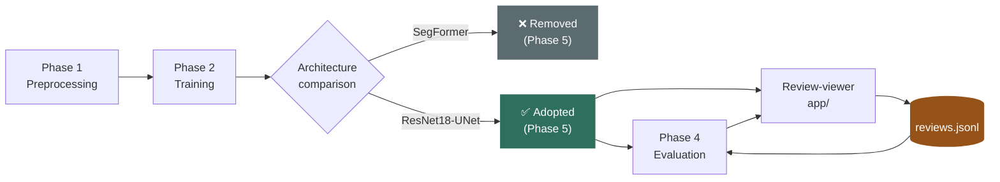
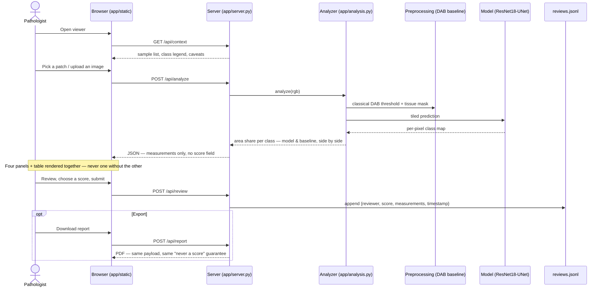

<div align="center">


<a href="https://github.com/jo-sh-varughese/biomarkher2-ai">
  
</a>

<br/>


<br/>


</div>

<br/>

## 📖 Table of contents

- [What is this?](#-what-is-this)
- [The one rule](#-the-one-rule)
- [How it fits together](#-how-it-fits-together)
- [Request flow (sequence diagram)](#-request-flow)
- [What's built](#-whats-built)
- [Project status](#-project-status)
- [Tech stack](#-tech-stack)
- [Quickstart](#-quickstart)
- [Project structure](#-project-structure)
- [Testing](#-testing)
- [Contributing](#-contributing)
- [Documentation map](#-documentation-map)
- [License](#-license)

<br/>

## 🩺 What is this?

Pathologists score HER2 immunohistochemistry (IHC) on a **0 / 1+ / 2+ / 3+**
scale from membrane staining intensity and completeness. That score decides
treatment — and the **2+ ("equivocal") category** triggers a second, costly
confirmatory test (FISH/ISH). Manual scoring at the borderlines is
subjective and varies between observers.

**BioMarkHER2** is an AI-assisted measurement tool that quantifies the
staining instead of eyeballing it — built as a final-year academic project
with **Kottayam Medical College** as the clinical reference point. It looks
at a stained field and reports, per intensity class, how much tissue area is
stained at that level. A *measurement*, handed to a pathologist — not a
verdict.

> [!IMPORTANT]
> There is no real whole-slide-image data yet — the 84 Kottayam slides
> aren't digitized. Everything here is built and validated against an
> approved public stand-in dataset (**HER2_IHC_40X**, ~11,000 patches) on a
> **CPU-only** machine. See [`PROJECT_PLAN.md`](PROJECT_PLAN.md) for exactly
> how that shapes the engineering.

<br/>

## 🚦 The one rule

> **This is a pre-scoring assistive tool that a pathologist reviews and
> confirms — never an autonomous final-scorer.**

That's not a slide-deck promise — it's enforced as executable code. No API
response or UI anywhere is allowed to carry a field named `score`,
`her2_score`, `verdict`, or `diagnosis`. `tests/test_app.py` scans the live
JSON on every test run and fails the build if one ever appears.

<br/>

## 🧭 How it fits together



Two architectures were actually built and compared head-to-head, same data /
split / seed / epochs — SegFormer lost on every class and was removed
entirely, not kept as a fallback. Full comparison in
[`PHASE5.md`](PHASE5.md).

<br/>

## 🔁 Request flow

What actually happens between opening the review-viewer and a confirmed
review landing on disk:



The score only ever enters the system through the `POST /api/review` step —
typed by a person, on an explicit submit. Nothing upstream of it can create
one.

<br/>

## 🧪 What's built

| | Phase | Highlights |
|---|---|---|
| 🔬 | **Phase 1 · Preprocessing** | Ruifrok & Johnston stain deconvolution, optical-density tissue detection (measured to fix a real Otsu failure mode), the classical DAB-threshold baseline, tiling. |
| 🧠 | **Phase 2 · Training** | Pseudo-labels from Phase 1 (no pixel annotations exist), a leakage-aware split with documented caveats, the segmentation training loop. |
| 📊 | **Phase 4 · Evaluation** | Conformal prediction (stain-shift-weighted for cross-institution uncertainty), stain-variation analysis, offline ASCO/CAP 2018 mapping + Cohen's kappa, PDF reports, Docker packaging. |
| 🏗️ | **Phase 5 · Architecture** | ResNet18-UNet (RGB + DAB optical density input) vs. SegFormer, compared head-to-head. U-Net won every class — moderate (2+) went from IoU 0.00006 to **0.589**. |
| 🖥️ | **Review-viewer** | Local, dependency-free web app — model vs. classical baseline always side by side, mandatory human review step, PDF export. |

<br/>

## 📈 Project status

<div align="center">


</div>

Per-class IoU, full-scale run (`artifacts/phase2_unet`) — tissue mean IoU
**0.746**, pixel accuracy **0.908**:

| class | negative | weak (1+) | **moderate (2+)** | strong (3+) |
|---|---|---|---|---|
| IoU | 0.839 | 0.666 | **0.589** ⚑ | 0.891 |

⚑ Moderate (2+) is the class that decides reflex FISH testing, and remains
the model's weakest — closing that gap is one of the three open workstreams
below.

6 of the original proposal's 9 scope items are done, 1 is partial, 2 are
blocked on data no engineering effort can substitute for (real WSIs, real
pathologist reviews). Full coverage table, the exact "what's left" split, and
the three-person task division: **[`PROJECT_PLAN.md`](PROJECT_PLAN.md)**.

<br/>

## 🛠️ Tech stack

| Layer | Tools |
|---|---|
| Model & training | PyTorch (CPU), ResNet18 encoder / U-Net decoder, focal + Dice + cross-entropy loss |
| Image processing | scikit-image, NumPy — colour deconvolution, tissue detection, tiling |
| Evaluation | Conformal prediction, Cohen's kappa, ASCO/CAP 2018 mapping |
| App | Python standard library (`http.server`) — no Flask/FastAPI, no CDN at runtime |
| Reports | ReportLab (PDF export) |
| Packaging | Docker + docker-compose |
| Config | Plain dataclasses + YAML — no Hydra, unknown keys rejected loudly |
| Tests | pytest — 283 tests, the project's actual specification |

<br/>

## ⚡ Quickstart

```bash
git clone https://github.com/jo-sh-varughese/biomarkher2-ai.git
cd biomarkher2-ai

python -m venv .venv
.venv\Scripts\activate                # macOS/Linux: source .venv/bin/activate
pip install -r requirements.txt
pip install torch --index-url https://download.pytorch.org/whl/cpu

pytest -q                             # 283 passed

python -m app.server --run artifacts/phase2_unet
# open http://127.0.0.1:8000
```

Or with Docker:

```bash
docker compose up --build
```

<br/>

## 📂 Project structure

<details>
<summary>Click to expand</summary>

```
preprocessing/    Phase 1 -- stain math, tissue detection, the classical baseline
training/         Phase 2 -- dataset, splits, losses, the training loop
models/           ResNet18-UNet wrapper + architecture dispatch
evaluation/       Phase 4 -- conformal prediction, stain variation, CAP/ASCO mapping
app/              the review-viewer frontend + PDF report export
configs/          YAML configs -- one file fully describes one run
scripts/          CLI entry points that call into the packages above
tests/            283 tests -- the project's actual specification
tasks/            self-contained task briefs for the three open workstreams
artifacts/        everything a run produces (gitignored -- regenerable)
data/             raw dataset + cached pseudo-label targets (gitignored)
```

</details>

<br/>

## ✅ Testing

```bash
pytest -q
```

283 tests, spanning every phase. A real category of them encodes the
project's framing rules as literal assertions — not just correctness checks
— specifically so a well-intentioned future edit can't erode them quietly.
See `IMPLEMENTATION_NOTES.md`'s "Testing philosophy".

<br/>

## 🤝 Contributing

Three self-contained workstreams are open right now, divided by directory so
people can work in parallel without stepping on each other:

| | Workstream | Brief |
|---|---|---|
| 🎯 | Model quality — close the moderate (2+) gap | [`tasks/person1_model_quality.md`](tasks/person1_model_quality.md) |
| 📐 | Evaluation & infra — full-scale runs, Docker, CI | [`tasks/person2_evaluation_infra.md`](tasks/person2_evaluation_infra.md) |
| 🖼️ | App & product — whole-slide groundwork, batch reports | [`tasks/person3_app_product.md`](tasks/person3_app_product.md) |

Each brief is written to be handed straight to your own LLM (ChatGPT, Gemini,
Claude — whatever you're using) as context. See
**[`CONTRIBUTING.md`](CONTRIBUTING.md)** for the branch → commit → PR
workflow and the rules that are load-bearing rather than style preferences.

<br/>

## 🗺️ Documentation map

| Doc | What's in it |
|---|---|
| [`PROJECT_PLAN.md`](PROJECT_PLAN.md) | Onboarding: what this is, coverage vs. the original brief, what's left |
| [`IMPLEMENTATION_NOTES.md`](IMPLEMENTATION_NOTES.md) | The full technical account, phase by phase, with the *why* behind every choice |
| [`PHASE2.md`](PHASE2.md) | Training: the resolution diagnosis, the split problem, run-by-run numbers |
| [`PHASE4.md`](PHASE4.md) | Conformal prediction, stain variation, CAP/ASCO mapping, Docker |
| [`PHASE5.md`](PHASE5.md) | The SegFormer vs. U-Net comparison, decision, and why |
| [`CONTRIBUTING.md`](CONTRIBUTING.md) | Branch/PR workflow |
| [`app/README.md`](app/README.md) | The review-viewer, developer-facing |

<br/>

## 📜 License

Not yet chosen — this is an unreleased academic project. Decide and add a
`LICENSE` file before sharing this repo outside the team.

<br/>

<div align="center">

Built for pathologists, not around them.


</div>
