<div align="center">


**AI-assisted HER2 IHC measurement — a pre-scoring aid a pathologist reviews, never an autonomous scorer.**
Built with Government Medical College Kottayam as the clinical reference point.


</div>

---

## 📌 Contents

1. [At a glance](#-at-a-glance)
2. [What we built, and when](#%EF%B8%8F-what-we-built-and-when)
3. [The pipeline](#-the-pipeline)
4. [How a slide flows through the system](#-how-a-slide-flows-through-the-system)
5. [The model](#-the-model)
6. [What the measurements mean](#-what-the-measurements-mean)
7. [The portal](#%EF%B8%8F-the-portal)
8. [Quality and verification](#-quality-and-verification)
9. [Running it](#-running-it)
10. [Limitations, stated plainly](#%EF%B8%8F-limitations-stated-plainly)
11. [What comes next](#%EF%B8%8F-what-comes-next)
12. [Glossary](#-glossary)

---

## ✨ At a glance

<div align="center">

| 🧪 **355** | 🎯 **0.811** | 🟠 **0.657** | ⏱️ **≈ 7 s** |
|:---:|:---:|:---:|:---:|
| automated tests passing | tissue mean IoU, 8-epoch model | IoU on the equivocal **2+** class (was 0.589) | per full 1024×1024 field analysis, laptop CPU |
| 🧫 **10,997** | 🖼️ **7** | 🌐 **2** | ✅ **6 / 9** |
| public HER2 IHC patches trained and tested on | views of every field | languages — English and മലയാളം | proposal scope items done; 2 wait on data |

</div>

> [!IMPORTANT]
> **The one rule.** BioMarkHER2 *measures* stained tissue and shows where the staining is. It never
> assigns a HER2 score. This is enforced in code, not just in wording: the analysis output may never
> carry a field called `score`, `her2_score`, `verdict` or `diagnosis`, and the test suite fails the
> build if one ever appears. A score enters the system in exactly one place — typed by a pathologist
> on an explicit sign-off (or against a region they marked), and logged under their name.

**In one paragraph.** HER2 immunohistochemistry is scored 0 / 1+ / 2+ / 3+ by eye, and the borderlines
— especially 0 vs 1+ (now the HER2-low boundary) and 2+ (which triggers a confirmatory FISH/ISH test) —
vary between observers. BioMarkHER2 turns a stained field into numbers: how much of the tissue falls
into each staining-intensity class, measured by a trained model *and* by a transparent classical rule,
side by side, with a calibrated flag wherever the model is unsure. The pathologist reads the
measurements, inspects exactly where each class sits, marks regions of interest, and records their own
score. Every sign-off is logged for audit.

---

## 🗓️ What we built, and when

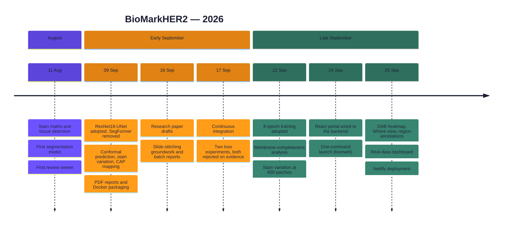
```mermaid
%%{init: {'theme':'base','themeVariables':{'primaryColor':'#efeefe','primaryTextColor':'#1b1f31','primaryBorderColor':'#5b45db','lineColor':'#8a90ab','cScale0':'#5b45db','cScale1':'#e08214','cScale2':'#2f6f5e'}}}%%
timeline
    title BioMarkHER2 — 2026
    section August
        11 Aug : Stain maths and tissue detection : First segmentation model : First review viewer
    section Early September
        09 Sep : ResNet18-UNet adopted, SegFormer removed : Conformal prediction, stain variation, CAP mapping : PDF reports and Docker packaging
        16 Sep : Research paper drafts : Slide-stitching groundwork and batch reports
        17 Sep : Continuous integration : Two loss experiments, both rejected on evidence
    section Late September
        22 Sep : 8-epoch training adopted : Membrane-completeness analysis : Stain variation at 800 patches
        24 Sep : React portal wired to the backend : One-command launch (biomark)
        25 Sep : DAB heatmap, Where view, region annotations : Real-data dashboard : Netlify deployment
```

<details>
<summary><b>This week, in detail</b> (22 – 25 September)</summary>

| Area | What changed |
|---|---|
| 🧠 Model | 8-epoch training run adopted on a rule fixed *before* the result: every class improved, 2+ IoU 0.589 → 0.657. |
| 🖥️ Portal | The new React portal now talks to the real Python backend; one command, `biomark`, builds and launches everything. |
| 🔥 Heatmap | A continuous DAB-intensity heatmap on a heat scale, with a colour bar marking the 1+/2+/3+ thresholds. |
| 🎯 Where view | Pick a class — defaulting to the field's own label — and only that class is painted, so a 2 % hot spot is findable at a glance. |
| ✍️ Annotations | Pathologists can draw boxes on the field and attach a note and/or a score to just that region; saved to an audit log. |
| 📊 Dashboard | Every figure now comes from the server's real review log — sign-offs, concordance, 14-day throughput, assessment mix. |
| 🎨 Legibility | Overlays drawn over a greyscale field instead of the brown stain; the 1+ colour re-stepped after it failed a contrast check. |
| ☁️ Deployment | The portal is live on Netlify in demo mode (password-protected), verified end-to-end in a real browser first. |

</details>

<div align="center">

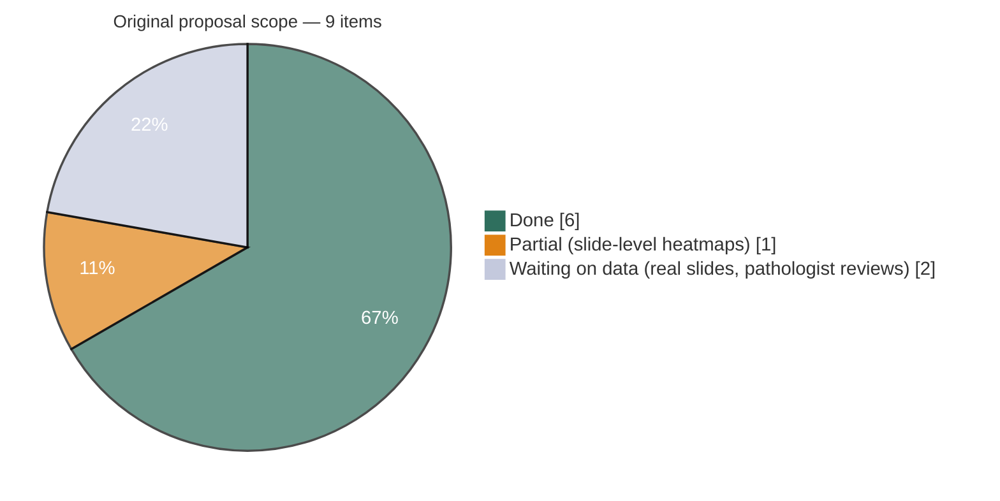
```mermaid
%%{init: {'theme':'base','themeVariables':{'pie1':'#2f6f5e','pie2':'#e08214','pie3':'#c4c9dd','pieTitleTextSize':'16px','pieSectionTextColor':'#ffffff','pieOuterStrokeWidth':'0px'}}}%%
pie showData
    title Original proposal scope — 9 items
    "Done" : 6
    "Partial (slide-level heatmaps)" : 1
    "Waiting on data (real slides, pathologist reviews)" : 2
```

</div>

---

## 🔬 The pipeline

Every field — a sample patch today, a tile of a whole slide tomorrow — goes through the same chain.

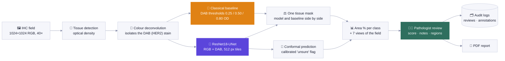
```mermaid
%%{init: {'theme':'base','themeVariables':{'primaryColor':'#f5f6fb','primaryTextColor':'#1b1f31','primaryBorderColor':'#c4c9dd','lineColor':'#8a90ab','fontSize':'14px'}}}%%
flowchart LR
    A["🖼️ IHC field<br/>1024×1024 RGB, 40×"] --> B["🧫 Tissue detection<br/>optical density"]
    B --> C["🎨 Colour deconvolution<br/>isolates the DAB (HER2) stain"]
    C --> D["📏 Classical baseline<br/>DAB thresholds 0.25 / 0.50 / 0.80 OD"]
    C --> E["🧠 ResNet18-UNet<br/>RGB + DAB, 512 px tiles"]
    D --> F["⚖️ One tissue mask<br/>model and baseline side by side"]
    E --> F
    E --> G["🎯 Conformal prediction<br/>calibrated 'unsure' flag"]
    F --> H["📊 Area % per class<br/>+ 7 views of the field"]
    G --> H
    H --> I["👩‍⚕️ Pathologist review<br/>score · notes · regions"]
    I --> J[("🗂️ Audit logs<br/>reviews · annotations")]
    I --> K["📄 PDF report"]

    style E fill:#5b45db,color:#fff,stroke:none
    style D fill:#e08214,color:#fff,stroke:none
    style I fill:#2f6f5e,color:#fff,stroke:none
```

| Stage | What it does | Why it matters |
|---|---|---|
| 🧫 **Tissue detection** | Separates tissue from glass by optical density | Every percentage is a share of *tissue*, never of empty glass |
| 🎨 **Colour deconvolution** | Ruifrok & Johnston separation into haematoxylin and **DAB** (the HER2 stain) | The quantitative claim rests here: intensity is read from DAB alone |
| 📏 **Classical baseline** | Buckets each tissue pixel by DAB density: *negative* < 0.25 ≤ *weak (1+)* < 0.50 ≤ *moderate (2+)* < 0.80 ≤ *strong (3+)* | Fully transparent, and the rule the model learned from — so it is always shown beside the model as a control |
| 🧠 **ResNet18-UNet** | Segments every pixel into background / negative / 1+ / 2+ / 3+ from the colour image plus the DAB channel | Learns spatial context the threshold rule cannot, e.g. membrane patterns |
| 🎯 **Conformal prediction** | Calibrates, per pixel, whether the model's answer narrows to one class | Where it doesn't, the field says so — an honest "look here" |
| 📊 **Measurement** | Area % of tissue per class, model and baseline, plus their disagreement | Numbers a pathologist can check against what they see |

### One real field, six of the seven views

<p align="center">
  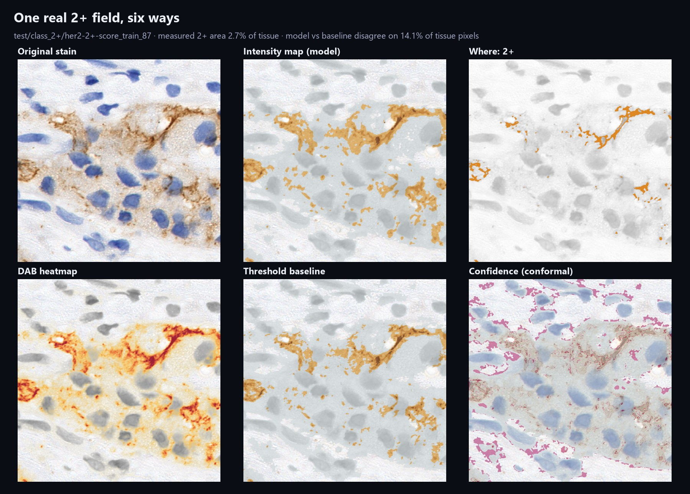
  <br/><sub>Server output for a real test patch labelled 2+ (the seventh view, the tissue mask, is omitted). The class maps and the heatmap are drawn over a greyscale copy of the field — warm overlays on brown DAB stain were nearly invisible.</sub>
</p>

---

## 🧭 How a slide flows through the system

### Today — one field, end to end

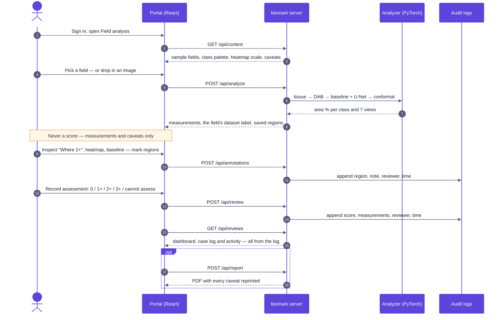
```mermaid
%%{init: {'theme':'base','themeVariables':{'actorBkg':'#5b45db','actorTextColor':'#ffffff','actorBorder':'#5b45db','signalColor':'#565d7c','signalTextColor':'#1b1f31','noteBkgColor':'#fff7e6','noteBorderColor':'#e08214','activationBkgColor':'#efeefe'}}}%%
sequenceDiagram
    autonumber
    actor P as Pathologist
    participant UI as Portal (React)
    participant S as biomark server
    participant A as Analyzer (PyTorch)
    participant L as Audit logs
    P->>UI: Sign in, open Field analysis
    UI->>S: GET /api/context
    S-->>UI: sample fields, class palette, heatmap scale, caveats
    P->>UI: Pick a field — or drop in an image
    UI->>S: POST /api/analyze
    S->>A: tissue → DAB → baseline + U-Net → conformal
    A-->>S: area % per class and 7 views
    S-->>UI: measurements, the field's dataset label, saved regions
    Note over UI,P: Never a score — measurements and caveats only
    P->>UI: Inspect "Where 2+", heatmap, baseline — mark regions
    UI->>S: POST /api/annotations
    S->>L: append region, note, reviewer, time
    P->>UI: Record assessment: 0 / 1+ / 2+ / 3+ / cannot assess
    UI->>S: POST /api/review
    S->>L: append score, measurements, reviewer, time
    UI->>S: GET /api/reviews
    S-->>UI: dashboard, case log and activity — all from the log
    opt Export
        UI->>S: POST /api/report
        S-->>UI: PDF with every caveat reprinted
    end
```

### Tomorrow — the 84 Kottayam slides

> [!NOTE]
> The Kottayam slides are **not yet digitised**, so no real whole-slide image has been processed. Everything
> below the scanner is built on the same code path proven today; the slide-scale pieces have been verified on
> synthetic mosaics stitched from real patches.

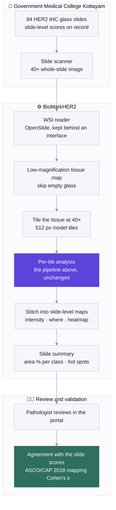
```mermaid
%%{init: {'theme':'base','themeVariables':{'primaryColor':'#f5f6fb','primaryTextColor':'#1b1f31','primaryBorderColor':'#c4c9dd','lineColor':'#8a90ab','clusterBkg':'#fbfbfe','clusterBorder':'#dfe2ee'}}}%%
flowchart TB
    subgraph K["🏥 Government Medical College Kottayam"]
        S1["84 HER2 IHC glass slides<br/>slide-level scores on record"] --> S2["Slide scanner<br/>40× whole-slide image"]
    end
    subgraph B["⚙️ BioMarkHER2"]
        S2 --> W1["WSI reader<br/>OpenSlide, kept behind an interface"]
        W1 --> W2["Low-magnification tissue map<br/>skip empty glass"]
        W2 --> W3["Tile the tissue at 40×<br/>512 px model tiles"]
        W3 --> W4["Per-tile analysis<br/>the pipeline above, unchanged"]
        W4 --> W5["Stitch into slide-level maps<br/>intensity · where · heatmap"]
        W5 --> W6["Slide summary<br/>area % per class · hot spots"]
    end
    subgraph R["👩‍⚕️ Review and validation"]
        W6 --> R1["Pathologist reviews in the portal"]
        R1 --> R2["Agreement with the slide scores<br/>ASCO/CAP 2018 mapping · Cohen's κ"]
    end

    style W4 fill:#5b45db,color:#fff,stroke:none
    style R2 fill:#2f6f5e,color:#fff,stroke:none
```

| Step | Status | Evidence |
|---|---|---|
| Tiling and stitching at slide scale | ✅ Built and verified | A 4096×4096 mosaic (64 model tiles) analysed in **40.6 s**; every tile's prediction matched the same tile analysed alone |
| Model speed per tile | ✅ Measured | **≈ 0.63 s per 512×512 tile** on the development laptop's CPU — a slide with 1,000 tissue tiles ≈ 10–11 minutes before any GPU |
| Slide-level summary and batch reports | ✅ Built | Batch/summary report across many fields; a pathologist-facing user guide |
| Agreement statistics vs pathologist scores | ✅ Built, awaiting data | Exact and within-one-category agreement, quadratic-weighted Cohen's κ — activates on the first real sign-offs |
| Digitised slides | ⏳ Waiting | No scanner output exists yet |

---

## 🧠 The model

| | |
|---|---|
| **Architecture** | U-Net decoder on a ResNet18 encoder, fed the colour image **plus the DAB optical-density channel** as a 4th input |
| **Output** | Per-pixel class: background, negative, weak (1+), moderate (2+), strong (3+) |
| **Training targets** | Pseudo-labels from the classical DAB rule — the dataset has no pixel annotations, so the model learns the rule's classes and adds spatial context |
| **Loss** | Focal + Dice + cross-entropy |
| **Hardware** | A laptop CPU; about 30 minutes per epoch |

<p align="center">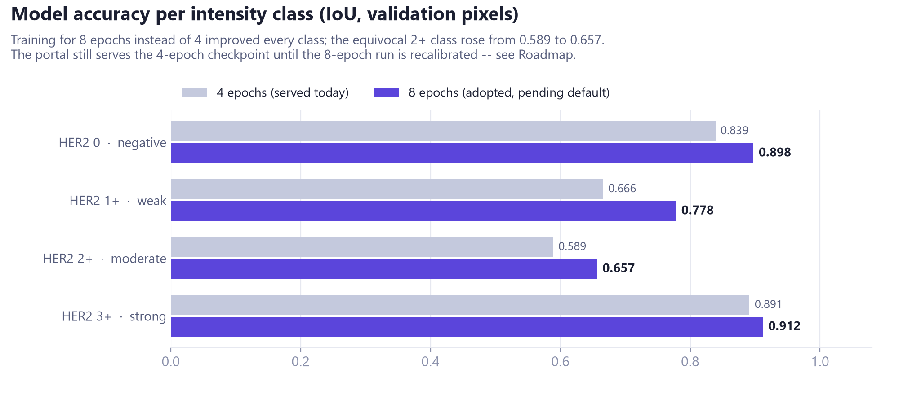</p>

<p align="center">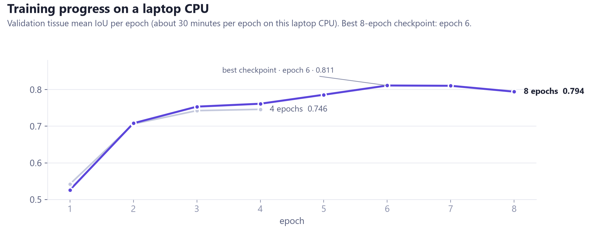</p>

<p align="center">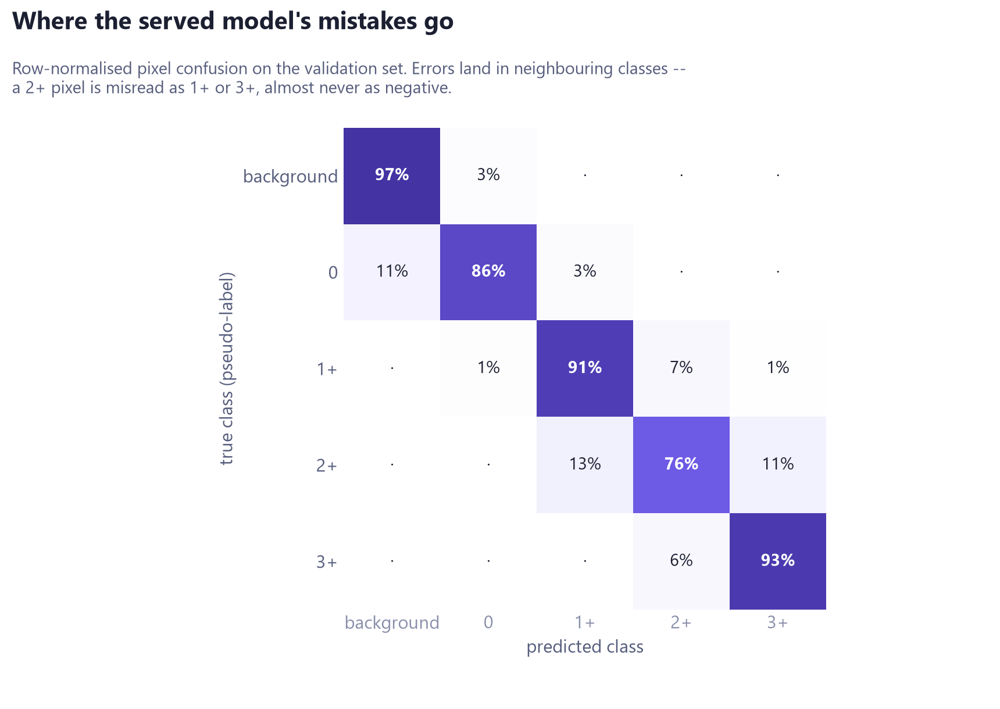</p>

**How we chose — every experiment decided by a rule fixed before its result:**

| Experiment | Result | Decision |
|---|---|---|
| SegFormer (original architecture) vs ResNet18-UNet | U-Net won every class; 2+ IoU **0.00006 → 0.589** | ✅ U-Net adopted, SegFormer removed entirely |
| Inverse-frequency class weighting | 2+ flat, other classes regressed | ❌ Rejected |
| Ordinal-distance auxiliary loss | 2+ ended below the baseline | ❌ Rejected |
| Train 8 epochs instead of 4 | Every class improved; 2+ **0.589 → 0.657**; tissue mean IoU **0.746 → 0.811** | ✅ Adopted — becomes the served default once its uncertainty calibration is re-run |

> [!WARNING]
> **Read validation numbers with their caveat.** The public dataset has no slide identifiers, so patches from
> one slide can appear on both sides of the split. The split is grouped by the dataset's provenance tokens —
> the best available — but it is not leakage-free, and every number here is agreement with the DAB rule's
> pseudo-labels, not with a pathologist.

---

## 📐 What the measurements mean

### The data behind the model

<p align="center">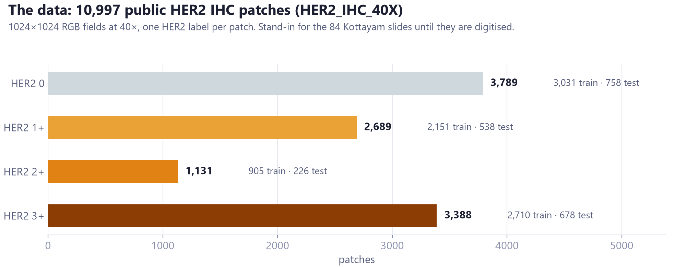</p>

### The single most important chart in this note

<p align="center">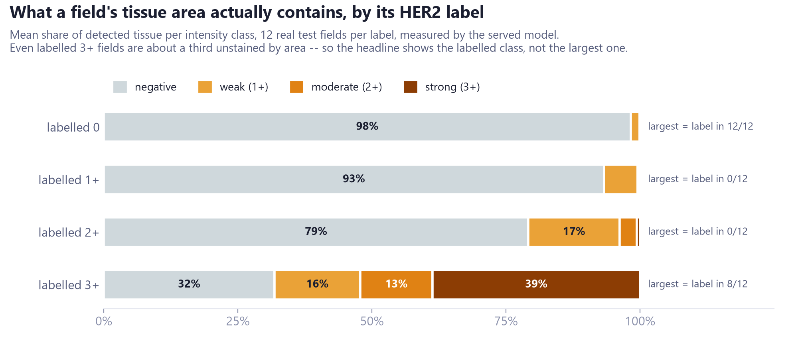</p>

A HER2 score is defined on the **percentage of tumour cells with membrane staining**, not on how much of a
field's area is brown. Real IHC is heterogeneous: across 12 real test fields per label, the *largest* class
by area matched the field's label in **0 of 12** fields labelled 1+ and **0 of 12** labelled 2+. Even fields
labelled 3+ were about a third unstained by area.

So the portal's headline does **not** show "the largest class". It shows the fact the data carries — *this
field is labelled 2+* — then exactly how much tissue is measured at 2+, and where it is. The total stained
share still rises steeply with the label (≈ 2 % → 7 % → 21 % → 68 % of tissue at 1+ or above), which is the
signal a pathologist can use.

> [!CAUTION]
> Percentages are of **tissue area**, not tumour cells. Stroma, lymphocytes, normal ducts and control tissue
> are all inside the denominator. The portal and every PDF report say this beside the numbers.

### Calibrated uncertainty

<p align="center">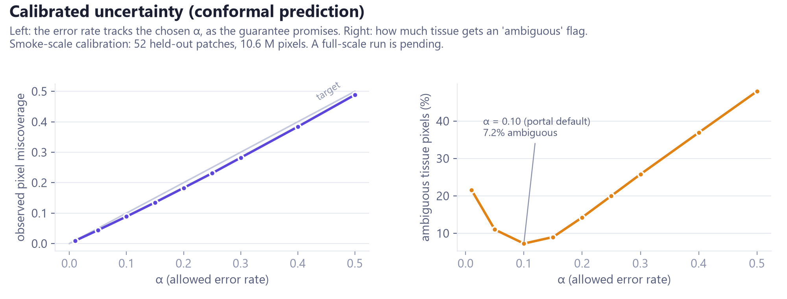</p>

Conformal prediction gives a statistical guarantee: at a chosen error rate α the model's prediction sets
miss the true class at most α of the time, and that is what the left panel shows. The portal uses
α = 0.10, which flags about **7 %** of tissue as *ambiguous* — the pixels where the model's calibrated
answer does not narrow to one class. Those pixels appear in the Confidence view, a colour scheme deliberately
unlike the intensity classes so it can never be misread as a fifth one.

<details>
<summary><b>Stain variation — what was measured, and why it is not over-claimed</b></summary>

Across the dataset's 8 provenance groups (800 patches), stain vectors differ more between groups than within
them (1.47×). But those groups are confounded with the HER2 label itself — 3+ groups are, by definition, more
heavily stained — so this shows the stain descriptor is sensitive, not that there is scanner or
cross-institution drift. A stain-shift-weighted variant of conformal prediction is built for exactly that
case; on this single-source dataset it behaves like the unweighted version, as it should. Real
multi-institution slides are needed to go further.

</details>

---

## 🖥️ The portal

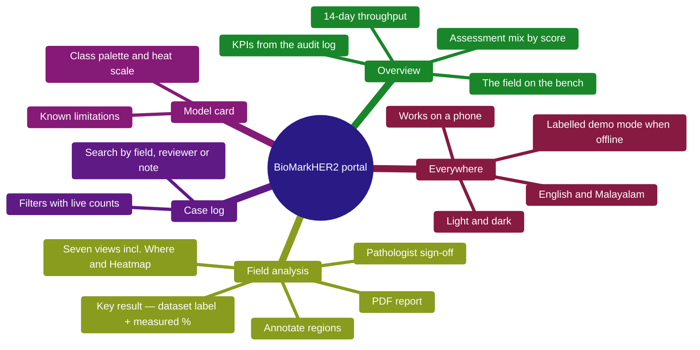
```mermaid
%%{init: {'theme':'base','themeVariables':{'primaryColor':'#5b45db','primaryTextColor':'#ffffff','lineColor':'#8a90ab'}}}%%
mindmap
  root((BioMarkHER2 portal))
    Overview
      KPIs from the audit log
      14-day throughput
      Assessment mix by score
      The field on the bench
    Field analysis
      Key result — dataset label + measured %
      Seven views incl. Where and Heatmap
      Annotate regions
      Pathologist sign-off
      PDF report
    Case log
      Filters with live counts
      Search by field, reviewer or note
    Model card
      Class palette and heat scale
      Known limitations
    Everywhere
      English and Malayalam
      Light and dark
      Works on a phone
      Labelled demo mode when offline
```

### Overview

<p align="center">
  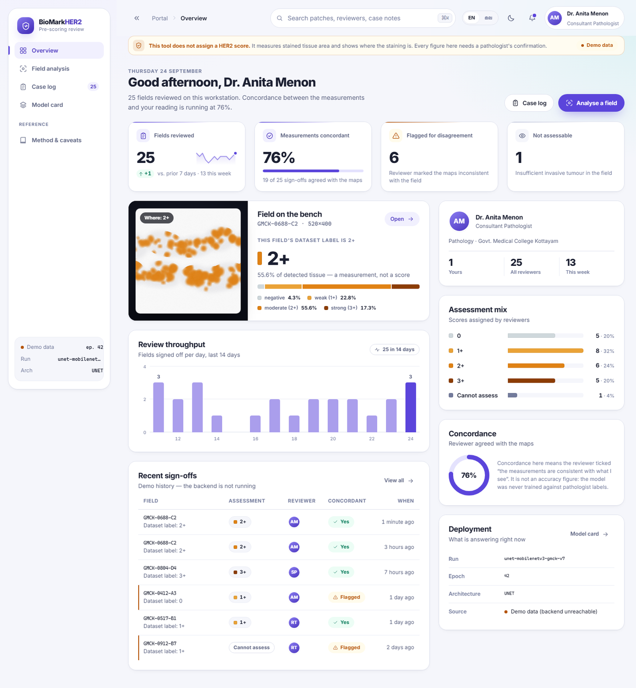
  <br/><sub>The overview — every tile, chart and row computed from the review log. Shown here in demo mode, exactly as deployed on Netlify; the "Demo data" badges are part of the design.</sub>
</p>

### Field analysis

<p align="center">
  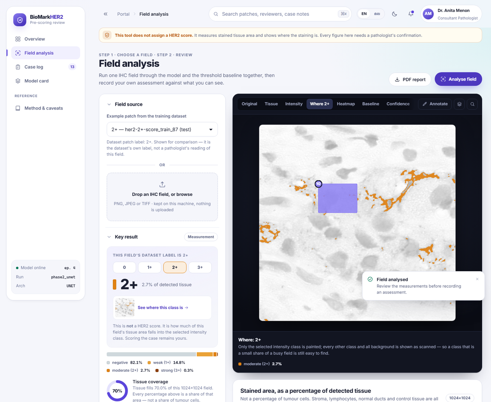
  <br/><sub>The working screen, on the live backend. The key result leads with the field's own label and the measured area for that class; the viewer is a dark instrument in both themes, as pathology viewers are.</sub>
</p>

<table>
  <tr>
    <td width="50%">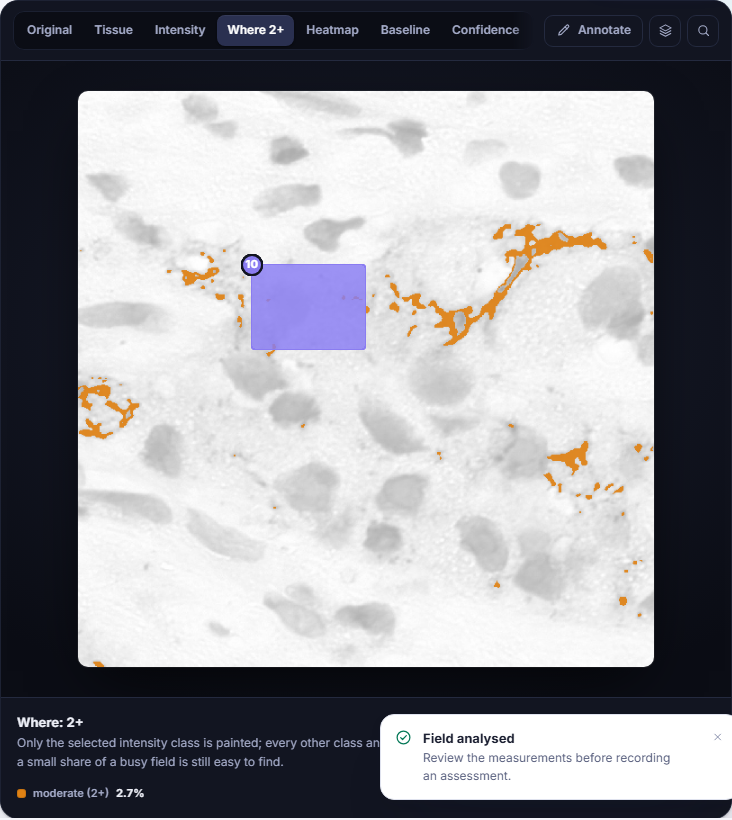<br/><sub><b>Where 2+</b> — only the class in focus is painted; saved region annotations stay on top.</sub></td>
    <td width="50%">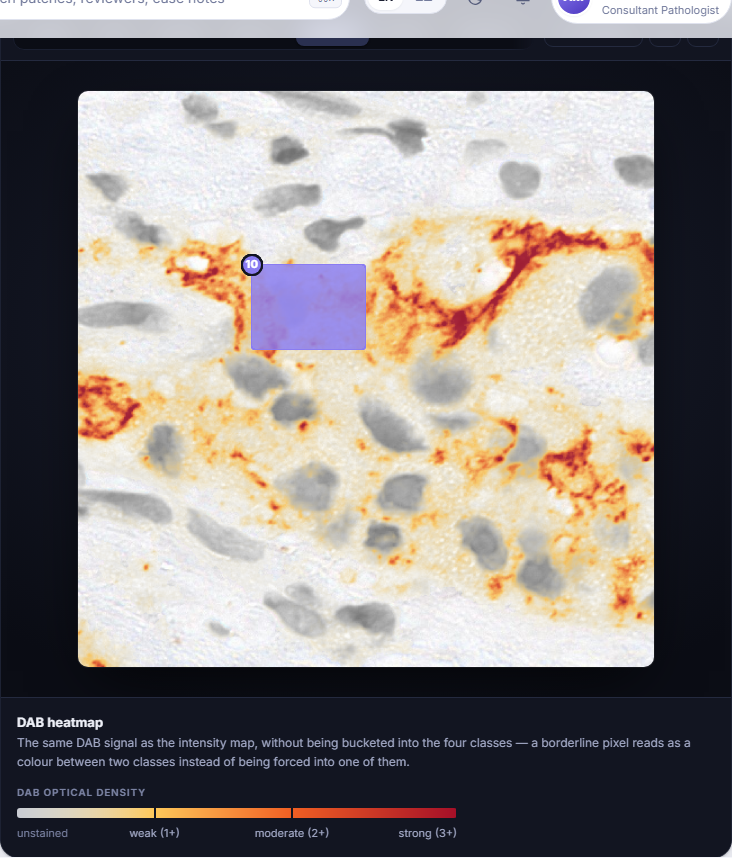<br/><sub><b>DAB heatmap</b> — the unbucketed signal, with a colour bar served by the backend so it can't drift from the pixels.</sub></td>
  </tr>
</table>

<table>
  <tr>
    <td width="30%" align="center">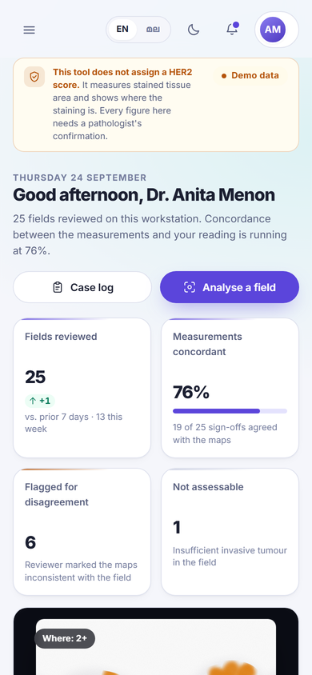<br/><sub>Overview on a phone</sub></td>
    <td width="30%" align="center">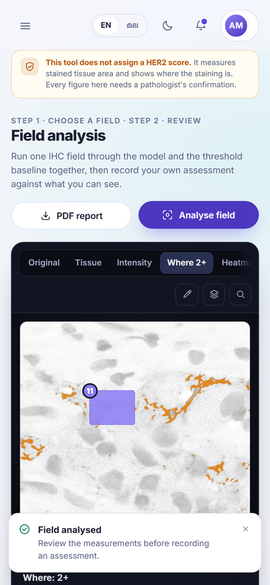<br/><sub>Analysis on a phone</sub></td>
    <td width="40%">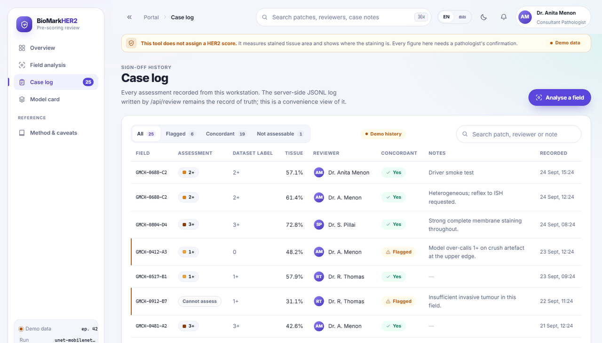<br/><sub><b>Case log</b> — the audit trail, with filter counts and search.</sub><br/><br/>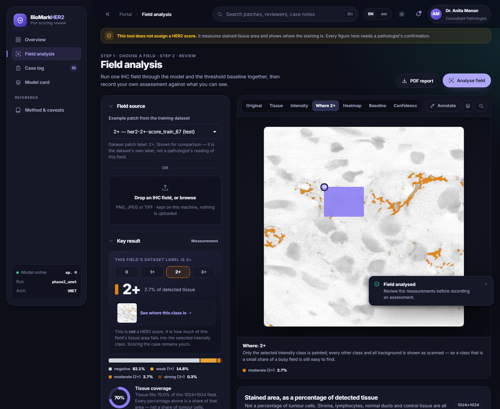<br/><sub><b>Dark theme</b>, chosen per user.</sub></td>
  </tr>
</table>

### How it is put together

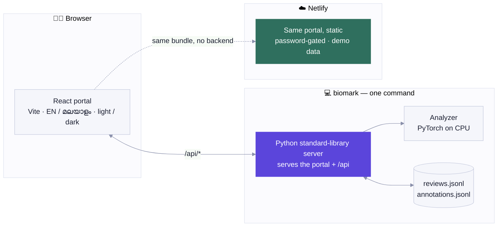
```mermaid
%%{init: {'theme':'base','themeVariables':{'primaryColor':'#f5f6fb','primaryTextColor':'#1b1f31','primaryBorderColor':'#c4c9dd','lineColor':'#8a90ab','clusterBkg':'#fbfbfe','clusterBorder':'#dfe2ee'}}}%%
flowchart LR
    subgraph Browser["🧑‍💻 Browser"]
        UI["React portal<br/>Vite · EN / മലയാളം · light / dark"]
    end
    subgraph Local["💻 biomark — one command"]
        SRV["Python standard-library server<br/>serves the portal + /api"]
        AN["Analyzer<br/>PyTorch on CPU"]
        LOG[("reviews.jsonl<br/>annotations.jsonl")]
    end
    subgraph Cloud["☁️ Netlify"]
        NET["Same portal, static<br/>password-gated · demo data"]
    end
    UI <-->|"/api/*"| SRV
    SRV --> AN
    SRV <--> LOG
    UI -.->|"same bundle, no backend"| NET

    style SRV fill:#5b45db,color:#fff,stroke:none
    style NET fill:#2f6f5e,color:#fff,stroke:none
```

<details>
<summary><b>API reference</b></summary>

| Method | Route | Purpose |
|---|---|---|
| `GET` | `/api/context` | Sample fields, class palette, heatmap scale, caveats, which model is loaded |
| `POST` | `/api/analyze` | Analyse a sample or uploaded field: area % per class (model and baseline), 7 views, dataset label, saved regions |
| `POST` | `/api/review` | Record a pathologist's assessment — the only way a score enters the system |
| `GET` | `/api/reviews` | The review log, newest first — feeds the overview, case log and activity panel |
| `POST` | `/api/annotations` | Save a marked region with a note and/or a score |
| `POST` | `/api/report` | Re-analyse and return a PDF report carrying every caveat |

</details>

> [!TIP]
> **Demo mode is a feature, not a fallback.** With no backend reachable — Netlify, a projector, a laptop with no
> model — the portal runs on a deterministic demo history and labels itself as demo on every screen. A synthetic
> field can never be mistaken for a real one, and a real sign-off can never be padded with synthetic ones.

---

## ✅ Quality and verification

- **355 automated tests** across every stage — correctness, and the framing rules (no score field anywhere; review
  only on an explicit submit; the 2+ caveat visible in the table, not only in footnotes).
- **Driven in a real browser** at desktop, phone and dark-theme sizes, live backend and demo mode, before any
  release: sign-in, every page, all seven views, region annotation, sign-off, PDF export, hard refresh on deep
  links — with every console error and failed request captured.
- **Colour choices validated, not eyeballed.** The class palette passes ordered-ramp checks (monotone lightness,
  single hue, readable light end) on both light and dark surfaces; that check is what moved the 1+ colour from
  `#ffd699` (1.37:1 on white) to `#eaa237`.
- **Honest numbers only.** The dashboard was re-plumbed so that every figure comes from the audit log, and a
  per-field speed claim on the sign-in page was corrected to the measured ≈ 7 s.

---

## 🚀 Running it

```bash
pip install -r requirements.txt      # plus the CPU build of PyTorch — see README
pip install -e .                     # registers the one command, once
biomark                              # builds the portal if needed, starts it, opens the browser
```

| Where | What you get |
|---|---|
| `http://127.0.0.1:8000` via `biomark` | The full system on the live model, local-only by design |
| [biomarkher2-portal.netlify.app](https://biomarkher2-portal.netlify.app) | The portal in demo mode, behind a site password |

> [!NOTE]
> The sign-in inside the portal is a demo login that runs in the browser — it identifies a reviewer, it does not
> secure anything. The Netlify site is protected by a separate server-side password; the local server binds to
> this machine only. Real authentication is required before any real patient data.

---

## ⚠️ Limitations, stated plainly

| | Limitation | What it means in practice |
|---|---|---|
| 🧬 | Trained on **pseudo-labels** from a threshold rule | Agreement with the baseline is not evidence of clinical accuracy; it has never seen a pathologist's label |
| 📐 | Measures **tissue area**, not tumour cells | Not interchangeable with the ASCO/CAP definition; the score stays the pathologist's |
| 🟠 | **2+ is the weakest class** (IoU 0.589 served, 0.657 adopted) | Any 2+ figure is a prompt to look, not a number to quote |
| 🖼️ | **One field at a time** until slides are digitised | Scoring is a slide-level judgement; this sees a field |
| 🔀 | Validation split is **not leakage-free** | The public data has no slide IDs; numbers are optimistic |
| 🎯 | Uncertainty calibration at **smoke scale** (52 patches) | Full-scale calibration is software-ready, not yet run |
| 🔐 | Demo sign-in, local-only server | A review and demonstration aid, not a deployable clinical service |

---

## 🗺️ What comes next

| | Next step | Needs |
|---|---|---|
| 🟢 | Make the 8-epoch model the served default and re-run full-scale uncertainty calibration for it | Compute time (multi-hour CPU jobs) |
| 🟢 | Train the queued DAB-threshold variant aimed at the 2+ boundary | Compute time |
| 🟡 | Real whole-slide analysis on the 84 Kottayam slides | **Digitised slides** |
| 🟡 | Agreement study — portal measurements vs slide-level scores (κ, ASCO/CAP mapping) | **Pathologist sign-offs** |
| 🔵 | Real authentication and deployment hardening | Before any real patient data |
| 🔵 | GPU inference for slide-scale throughput | Hardware |

---

## 📚 Glossary

<details>
<summary>Open</summary>

| Term | Meaning |
|---|---|
| **IHC** | Immunohistochemistry — staining tissue so a specific protein (here HER2) becomes visible |
| **DAB** | The brown chromogen marking HER2; its density is what BioMarkHER2 measures |
| **OD** | Optical density — how strongly a pixel absorbs light, per stain |
| **Colour deconvolution** | Separating a colour image into per-stain intensity maps (haematoxylin, DAB) |
| **Pseudo-label** | A training target produced by a rule rather than drawn by a person |
| **IoU** | Intersection-over-union: overlap between predicted and target regions, 0 to 1 |
| **Conformal prediction** | A method that turns model outputs into prediction sets with a guaranteed error rate |
| **HER2-low** | HER2 1+ or 2+ without gene amplification — now a treatment-relevant category |
| **FISH / ISH** | In-situ hybridisation — the confirmatory test a 2+ result triggers |
| **WSI** | Whole-slide image — a digitised glass slide, gigapixels in size |

</details>

---

<div align="center">

<sub>Built for pathologists, not around them. Research and workflow-support use only — not a medical device, not validated for diagnostic use.<br/>
Figures in this note are generated from the project's own run artifacts and from measurements on real test fields taken on 24–25 September 2026.</sub>


</div>
